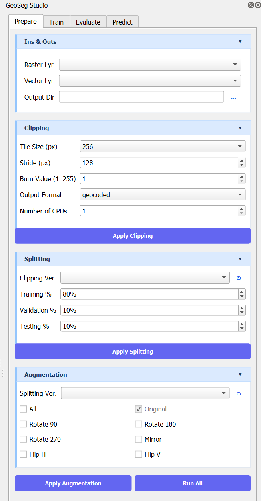
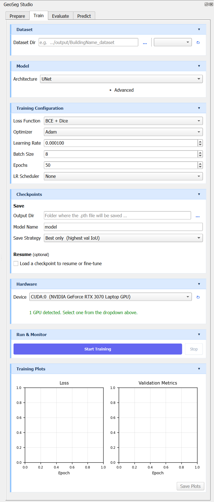
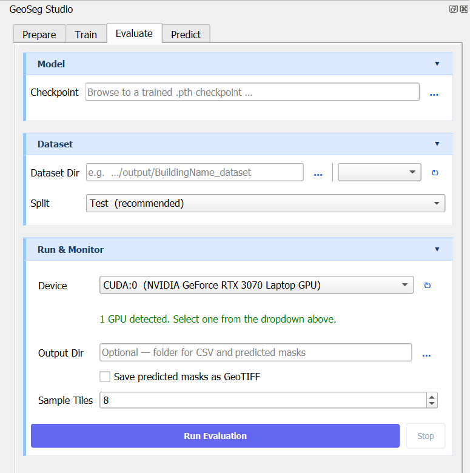
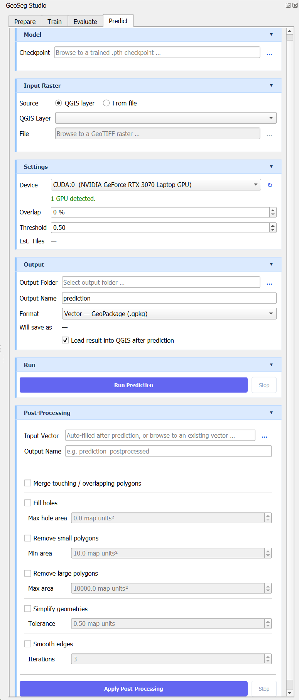

# GeoSeg Studio

**GeoSeg Studio** is an open-source QGIS plugin for deep learning semantic segmentation of geospatial raster data — no coding required.

It provides a complete end-to-end workflow inside QGIS: prepare training data, train your own segmentation model, evaluate its performance, run predictions on new rasters, and post-process the vector outputs — all in one place.

Developed and maintained by [Dronnix](https://www.dronnix.com) — a drone mapping and geospatial AI company.

---

## Screenshots

| Prepare | Train |
|---------|-------|
|  |  |

| Evaluate | Predict |
|----------|---------|
|  |  |

---

## Key Features

- Full pipeline in a single plugin: data preparation → training → evaluation → prediction
- 7 deep learning architectures for binary semantic segmentation
- GPU (NVIDIA CUDA) and CPU support
- Sliding-window inference on full-resolution rasters with overlap blending
- Vector post-processing: merge, fill holes, area filtering, simplify, smooth
- No command line required — everything runs through the QGIS interface
- Isolated Python environment — does not interfere with your QGIS installation

---

## Requirements

| Requirement | Minimum |
|-------------|---------|
| Operating System | Windows 10 / 11 |
| QGIS | 3.10 or later |
| Python | 3.9+ (bundled with QGIS) |
| GPU (optional) | NVIDIA GPU with CUDA 11.8, 12.1, or 12.4 |
| RAM | 8 GB minimum, 16 GB recommended |
| Disk space | ~5 GB free (for PyTorch installation) |

> Linux and macOS support is planned for a future release.

---

## Installation

### Step 1 — Install the plugin

**Option A: QGIS Plugin Manager (recommended)**
1. Open QGIS
2. Go to **Plugins → Manage and Install Plugins**
3. Search for `GeoSeg Studio`
4. Click **Install Plugin**

**Option B: Manual installation**
1. Download the latest `GeoSegStudio.zip` from the [Releases](https://github.com/dronnix-io/GeoSegStudio/releases) page
2. In QGIS go to **Plugins → Manage and Install Plugins → Install from ZIP**
3. Select the downloaded ZIP and click **Install Plugin**

**Option C: Build from source**
```bash
git clone https://github.com/dronnix-io/GeoSegStudio.git
cd GeoSegStudio
python package.py
```
This produces `dist/GeoSegStudio.zip`. Install it via Option B above.

### Step 2 — Install PyTorch (first run only)

On the first launch, GeoSeg Studio will open a setup dialog asking you to choose your hardware:

- **NVIDIA GPU — CUDA 11.8** — GTX/RTX 10xx, 20xx, 30xx series (older drivers)
- **NVIDIA GPU — CUDA 12.1** — RTX 30xx, 40xx series
- **NVIDIA GPU — CUDA 12.4** — RTX 40xx series (latest drivers)
- **CPU only** — no NVIDIA GPU, or unsure

The plugin installs PyTorch automatically into an isolated environment (`env/` inside the plugin folder). This does not affect your system Python or QGIS installation.

> To check your CUDA version: open a terminal and run `nvidia-smi`. The CUDA version is shown in the top-right corner.

---

## Workflow Overview

GeoSeg Studio is organized into four tabs, each covering one stage of the pipeline:

### Tab 1 — Prepare

Converts raw raster and vector data into a training-ready dataset.

1. **Clip** — slides a window over the raster and clips tiles. The matching vector layer is rasterized into binary masks.
2. **Split** — divides the clipped tiles into train / validation / test subsets at user-defined percentages.
3. **Augment** — applies geometric transforms to increase dataset size. Available transforms: original, rotate 90°/180°/270°, mirror, flip horizontal, flip vertical.

Each stage is versioned so you can experiment with different settings without overwriting previous results.

### Tab 2 — Train

Configures and runs model training.

- Choose an architecture, number of input channels, and base channel width
- Set loss function, optimizer, learning rate, batch size, epochs, and scheduler
- Select device (CPU or CUDA GPU)
- Monitor training live: per-epoch loss and metrics table, real-time loss curves
- Save checkpoints (best model only, or every N epochs)
- Resume training or fine-tune from an existing checkpoint

### Tab 3 — Evaluate

Assesses a trained model on a chosen data split.

Metrics reported:
- IoU (Intersection over Union)
- F1 / Dice
- Precision
- Recall
- Pixel Accuracy
- Confusion matrix (TP, FP, TN, FN)

Outputs a per-tile CSV and sample visualization tiles (image, ground truth, prediction).

### Tab 4 — Predict

Runs inference on a new full-resolution raster.

- Sliding-window inference with configurable overlap percentage and overlap blending
- Configurable sigmoid threshold (default 0.5)
- Output formats: raster (GeoTIFF), vector (GeoPackage or Shapefile), or both
- Optionally loads results directly into QGIS on completion

**Post-processing** (applied to vector output):
- Merge touching / overlapping polygons
- Fill holes below a configurable area threshold
- Remove polygons smaller or larger than defined area limits
- Simplify edges (Douglas-Peucker)
- Smooth edges (Chaikin corner-cutting)

---

## Supported Models

| Model | Type | Notes |
|-------|------|-------|
| UNet | CNN | Classic encoder-decoder with skip connections |
| Attention UNet | CNN | UNet with soft attention gates |
| UNet++ | CNN | Dense nested skip connections |
| LinkNet | CNN | Lightweight residual encoder-decoder |
| DeepLabV3+ | CNN | Dilated convolutions with ASPP |
| SwinUNet | Transformer | Pure Swin Transformer encoder-decoder |
| SegFormer | Transformer | Mix Transformer encoder + MLP decoder |

All models perform **binary segmentation** (one foreground class vs. background).

**Input constraints:**
- Patch size: 64, 128, 256, 512, or 1024 pixels (square)
- Input bands: 1 to 10

---

## Training Configuration

| Option | Available choices |
|--------|------------------|
| Loss function | BCE, Dice, BCE + Dice |
| Optimizer | Adam, AdamW, SGD |
| LR Scheduler | StepLR, Cosine Annealing, ReduceLROnPlateau |
| Device | CPU, CUDA (auto-detects available GPUs) |

---

## Project Structure

```
GeoSegStudio/
├── DL/                        # Deep learning core
│   ├── architectures.py       # 7 model architectures
│   ├── trainer.py             # Training worker (QThread)
│   ├── predictor.py           # Inference worker (QThread)
│   ├── evaluator.py           # Evaluation worker (QThread)
│   ├── dataset.py             # PyTorch Dataset / DataLoader
│   ├── losses.py              # BCE, Dice, BCE+Dice loss functions
│   ├── postprocessor.py       # Vector post-processing worker
│   ├── env_manager.py         # Isolated venv management
│   └── data_preparation/      # Clip → split → augment pipeline
├── ui/                        # PyQt5 UI (4 tabs + dialogs)
├── plugin.py                  # QGIS plugin entry point
├── metadata.txt               # QGIS plugin metadata
└── requirements.txt           # PyTorch installation reference
```

---

## Known Limitations

- Binary segmentation only (two classes: foreground and background)
- Windows only in the current release
- NVIDIA GPUs only for GPU-accelerated training (AMD and Intel GPUs not supported)
- Input patches must be square

---

## Contributing

Contributions are welcome. To get started:

1. Fork the repository
2. Create a feature branch: `git checkout -b feature/your-feature`
3. Commit your changes
4. Open a pull request against `main`

For bug reports and feature requests, please use the [issue tracker](https://github.com/dronnix-io/GeoSegStudio/issues).

---

## License

This project is licensed under the **GNU General Public License v2.0** — see the [LICENSE](LICENSE) file for details.

> GeoSeg Studio is a QGIS plugin. QGIS is licensed under the GPL v2, and QGIS plugins are required to be GPL v2 compatible.

---

## About Dronnix

[Dronnix](https://www.dronnix.com) is a drone mapping and geospatial AI company specializing in data collection and analysis for solar panel inspection, agriculture, urban growth monitoring, construction progress tracking, and large-scale mapping missions.

GeoSeg Studio is part of Dronnix's open tooling layer. Future releases will include pre-trained models for common object extraction tasks, available via Dronnix API memberships.

**Contact:** salar@dronnix.com
