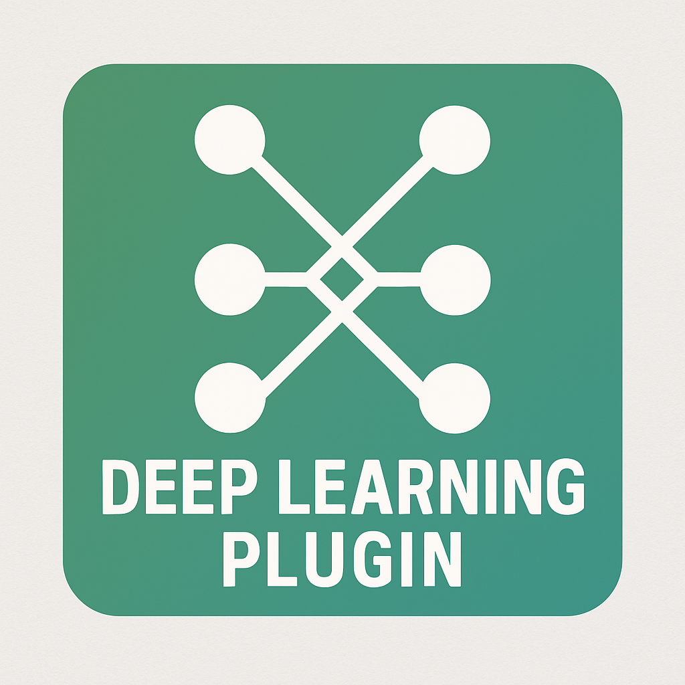
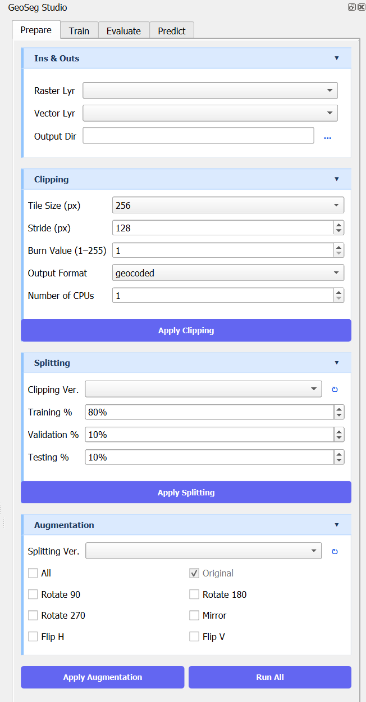
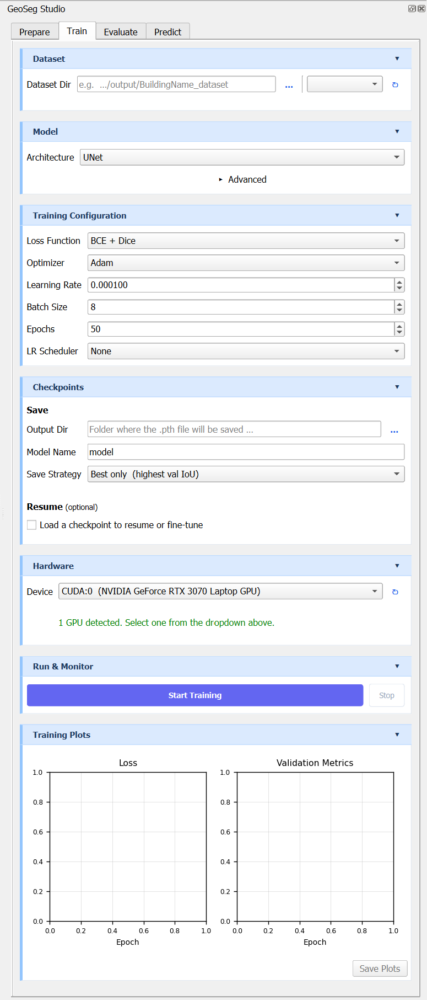
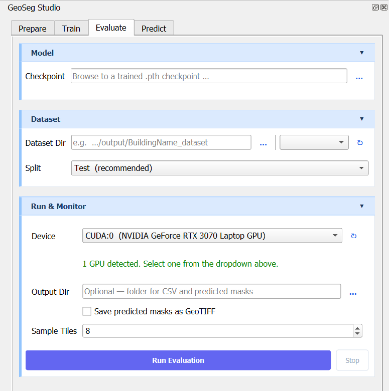
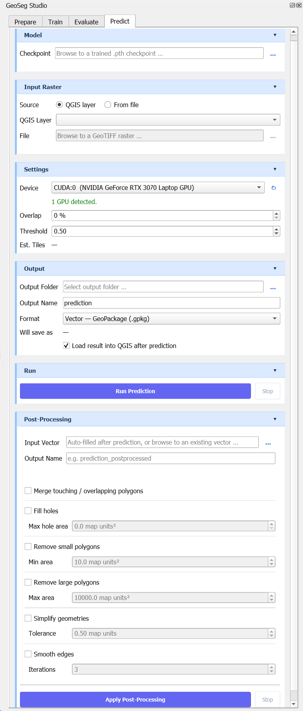

<p align="center">
  
</p>

# GeoSeg Studio

**GeoSeg Studio** is an open-source QGIS plugin for deep learning semantic segmentation of geospatial raster data — no coding required.

It provides a complete end-to-end workflow inside QGIS: prepare training data, train your own segmentation model, evaluate its performance, run predictions on new rasters, and post-process the vector outputs — all in one place.

Developed and maintained by [Dronnix](https://www.dronnix.com) — a drone mapping and geospatial AI company.

---

## Screenshots

<p align="center">
  
  &nbsp;
  
  &nbsp;
  
  &nbsp;
  
</p>
<p align="center">
  <sub>Prepare &nbsp;&nbsp;&nbsp;&nbsp;&nbsp;&nbsp;&nbsp;&nbsp;&nbsp;&nbsp;&nbsp;&nbsp;&nbsp;&nbsp;&nbsp;&nbsp;&nbsp;&nbsp;&nbsp;&nbsp; Train &nbsp;&nbsp;&nbsp;&nbsp;&nbsp;&nbsp;&nbsp;&nbsp;&nbsp;&nbsp;&nbsp;&nbsp;&nbsp;&nbsp;&nbsp;&nbsp;&nbsp;&nbsp;&nbsp;&nbsp; Evaluate &nbsp;&nbsp;&nbsp;&nbsp;&nbsp;&nbsp;&nbsp;&nbsp;&nbsp;&nbsp;&nbsp;&nbsp;&nbsp;&nbsp;&nbsp;&nbsp;&nbsp;&nbsp;&nbsp;&nbsp; Predict</sub>
</p>

---

## What's New in 1.1.0

**QGIS 4 support.** The plugin now runs on both QGIS 3 (Qt5) and QGIS 4 (Qt6).

**Security fixes.** Two issues are resolved in this release, and we recommend
updating:

- Model checkpoints are now loaded with pickle execution disabled. Previously a
  `.pth` file could execute arbitrary code when opened — a real risk for
  checkpoints downloaded from model zoos, forums or colleagues. Checkpoints
  written by GeoSeg Studio are unaffected and load exactly as before.
- The first-run setup no longer downloads and executes `get-pip.py` from the
  network. pip is now provisioned from the Python standard library that ships
  with QGIS, so no unverified code is fetched and run during installation.

**Bug fixes.**

- The plugin failed to load entirely on Python below 3.12 (a syntax error
  introduced in 1.0.0). This affected Linux builds of QGIS using the
  distribution Python, such as Ubuntu 22.04 and Debian 12.
- The toolbar button showed no icon, appearing as blank space, because it
  referenced a Qt resource path that was never compiled.

**Improvements.**

- The PyTorch environment moved out of the plugin folder and now lives with your
  QGIS profile, so plugin updates no longer delete it.
- The installer detects your GPU and NVIDIA driver and preselects a CUDA build
  that will actually run, rather than defaulting to CPU. CUDA 12.6 and 12.8
  (RTX 50xx / Blackwell) were added.
- The plugin panel now opens immediately instead of pausing while PyTorch loads.

See [Upgrading from an earlier version](#upgrading-from-an-earlier-version) before updating.

---

## Key Features

- Full pipeline in a single plugin: data preparation → training → evaluation → prediction
- 7 deep learning architectures for binary semantic segmentation
- GPU (NVIDIA CUDA) and CPU support
- Sliding-window inference on full-resolution rasters with overlap blending
- Vector post-processing: merge, fill holes, area filtering, simplify, smooth
- No command line required — everything runs through the QGIS interface
- Runs on both QGIS 3 and QGIS 4 (Qt5 and Qt6)
- Automatic GPU detection — reads your NVIDIA driver and installs a CUDA build that will actually run
- Isolated Python environment — does not interfere with your QGIS installation, and survives plugin updates

---

## Requirements

| Requirement | Minimum |
|-------------|---------|
| Operating System | Windows 10 / 11 |
| QGIS | 3.34 or later — QGIS 3 and QGIS 4 are both supported |
| Python | 3.9+ (bundled with QGIS) |
| GPU (optional) | NVIDIA GPU, driver 522.06 or newer (run `nvidia-smi` to check) |
| RAM | 8 GB minimum, 16 GB recommended |
| Disk space | ~5 GB free (for PyTorch installation) |

> Linux and macOS support is planned for a future release.

---

## Installation

### Step 1 — Install the plugin

**Option A: QGIS Plugin Manager (recommended)**
1. Open QGIS
2. Go to **Plugins → Manage and Install Plugins**
3. Search for `GeoSeg Studio`
4. Click **Install Plugin**

**Option B: Install from ZIP**
1. Download the latest `GeoSegStudio.zip` from the [Releases](https://github.com/dronnix-io/GeoSegStudio/releases) page
2. In QGIS go to **Plugins → Manage and Install Plugins → Install from ZIP**
3. Select the downloaded ZIP and click **Install Plugin**

**Option C: Build from source**
```bash
git clone https://github.com/dronnix-io/GeoSegStudio.git
cd GeoSegStudio
python package.py
```
This produces `dist/GeoSegStudio.zip`. Install it via Option B above.

### Upgrading from an earlier version

**Close QGIS before upgrading.** QGIS replaces the plugin folder during an
update without unloading the plugin first, so on Windows the upgrade fails with
*"Failed to remove the directory"* if PyTorch has been loaded in that session.
Quit QGIS, reopen it, and upgrade before opening the GeoSeg Studio panel.

Upgrading **from 1.0.0** additionally requires reinstalling PyTorch once. Up to
1.0.0 the environment lived inside the plugin folder, which QGIS deletes on
update; from 1.1.0 it lives with your QGIS profile and is kept across updates,
so this is a one-time cost. The setup dialog appears automatically when the
plugin next starts.

### Step 2 — Launch the plugin

After installation, open the plugin in QGIS via:

**Plugins → GeoSeg Studio → GeoSeg Studio**

Alternatively, click the **GeoSeg Studio icon** in the QGIS toolbar. The plugin opens as a dock panel on the right side of the QGIS window.

### Step 3 — Install PyTorch (first run only)

On the first launch, GeoSeg Studio will open a setup dialog asking you to choose your hardware:

- **NVIDIA GPU — CUDA 12.8** — RTX 50xx / Blackwell (driver 570+)
- **NVIDIA GPU — CUDA 12.6** — RTX 20xx / 30xx / 40xx (driver 527+)
- **NVIDIA GPU — CUDA 11.8** — GTX 10xx and older drivers (522+)
- **CPU only** — no NVIDIA GPU, or an AMD/Intel GPU

The plugin runs `nvidia-smi`, reads your driver version, and preselects the
option your machine can actually run — including falling back to CPU when the
driver is too old for any CUDA build. You only need to change the selection if
you have a reason to.
- **CPU only** — no NVIDIA GPU, or unsure

The plugin installs PyTorch automatically into an isolated environment stored with your QGIS profile, at `<QGIS profile>/geoseg_studio/env/`. This does not affect your system Python or QGIS installation. Keeping it outside the plugin folder means plugin updates no longer delete it, so PyTorch is downloaded once rather than after every release.

> **Not sure which option to pick?**
> - If you have no NVIDIA GPU, or you are unsure — select **CPU only**. The plugin will work fully, just without GPU acceleration.
> - The preselected option is based on your actual driver version, so accepting it is normally correct.
> - Picking a CUDA version newer than your driver supports installs fine but leaves the GPU unused — the Train tab's Hardware section will then show "CUDA is not available".
> - To change your choice later (after a driver update, or if you picked CPU by mistake), use **Plugins → GeoSeg Studio → GeoSeg Studio — PyTorch Setup…**. Restart QGIS first and do not open the GeoSeg Studio panel before reinstalling, otherwise Windows keeps the PyTorch files locked and the rebuild fails.

> **AMD and Intel GPUs** are not supported for GPU acceleration. Select **CPU only**.

---

## Sample Dataset

A sample dataset for testing GeoSeg Studio is available on Hugging Face:

**[Drone Building Extraction Dataset — Calgary](https://huggingface.co/datasets/dronnix-io/drone-building-extraction)**

- High-resolution drone imagery (DJI Matrice 4E) over a residential area in Calgary, Alberta, Canada
- 4-band GeoTIFF orthomosaics (RGB + Alpha) with manually annotated building polygons
- Ready to use directly in the Prepare tab — no pre-processing required
- License: CC BY 4.0

---

## Workflow Overview

GeoSeg Studio is organized into four tabs, each covering one stage of the pipeline:

### Tab 1 — Prepare

Converts raw raster and vector data into a training-ready dataset.

1. **Clip** — slides a window over the raster and clips tiles. The matching vector layer is rasterized into binary masks.
2. **Split** — divides the clipped tiles into train / validation / test subsets at user-defined percentages.
3. **Augment** — applies geometric transforms to increase dataset size. Available transforms: original, rotate 90°/180°/270°, mirror, flip horizontal, flip vertical.

Each stage is versioned so you can experiment with different settings without overwriting previous results.

### Tab 2 — Train

Configures and runs model training.

- Choose an architecture, number of input channels, and base channel width
- Set loss function, optimizer, learning rate, batch size, epochs, and scheduler
- Select device (CPU or CUDA GPU)
- Monitor training live: per-epoch loss and metrics table, real-time loss curves
- Save checkpoints (best model only, or every N epochs)
- Resume training or fine-tune from an existing checkpoint

### Tab 3 — Evaluate

Assesses a trained model on a chosen data split.

Metrics reported:
- IoU (Intersection over Union)
- F1 / Dice
- Precision
- Recall
- Pixel Accuracy
- Confusion matrix (TP, FP, TN, FN)

Outputs a per-tile CSV and sample visualization tiles (image, ground truth, prediction).

### Tab 4 — Predict

Runs inference on a new full-resolution raster.

- Sliding-window inference with configurable overlap percentage and overlap blending
- Configurable sigmoid threshold (default 0.5)
- Output formats: raster (GeoTIFF), vector (GeoPackage or Shapefile), or both
- Optionally loads results directly into QGIS on completion

**Post-processing** (applied to vector output):
- Merge touching / overlapping polygons
- Fill holes below a configurable area threshold
- Remove polygons smaller or larger than defined area limits
- Simplify edges (Douglas-Peucker)
- Smooth edges (Chaikin corner-cutting)

---

## Supported Models

| Model | Type | Notes |
|-------|------|-------|
| UNet | CNN | Classic encoder-decoder with skip connections |
| Attention UNet | CNN | UNet with soft attention gates |
| UNet++ | CNN | Dense nested skip connections |
| LinkNet | CNN | Lightweight residual encoder-decoder |
| DeepLabV3+ | CNN | Dilated convolutions with ASPP |
| SwinUNet | Transformer | Pure Swin Transformer encoder-decoder |
| SegFormer | Transformer | Mix Transformer encoder + MLP decoder |

All models perform **binary segmentation** (one foreground class vs. background).

**Input constraints:**
- Patch size: 64, 128, 256, 512, or 1024 pixels (square)
- Input bands: 1 to 40 (supports hyperspectral imagery)

---

## Training Configuration

| Option | Available choices |
|--------|------------------|
| Loss function | BCE, Dice, BCE + Dice |
| Optimizer | Adam, AdamW, SGD |
| LR Scheduler | StepLR, Cosine Annealing, ReduceLROnPlateau |
| Device | CPU, CUDA (auto-detects available GPUs) |

---

## Project Structure

```
GeoSegStudio/
├── DL/                        # Deep learning core
│   ├── architectures.py       # 7 model architectures
│   ├── trainer.py             # Training worker (QThread)
│   ├── predictor.py           # Inference worker (QThread)
│   ├── evaluator.py           # Evaluation worker (QThread)
│   ├── dataset.py             # PyTorch Dataset / DataLoader
│   ├── losses.py              # BCE, Dice, BCE+Dice loss functions
│   ├── postprocessor.py       # Vector post-processing worker
│   ├── env_manager.py         # Isolated venv management
│   └── data_preparation/      # Clip → split → augment pipeline
├── ui/                        # PyQt5 UI (4 tabs + dialogs)
├── plugin.py                  # QGIS plugin entry point
├── metadata.txt               # QGIS plugin metadata
└── requirements.txt           # PyTorch installation reference
```

---

## Known Limitations

- Binary segmentation only (two classes: foreground and background)
- Windows only in the current release
- NVIDIA GPUs only for GPU-accelerated training (AMD and Intel GPUs not supported)
- Input patches must be square
- QGIS 4 support is new in 1.1.0 and has had less real-world exposure than the
  QGIS 3 path; please report anything that misbehaves on the issue tracker

---

## Contributing

Contributions are welcome. To get started:

1. Fork the repository
2. Create a feature branch: `git checkout -b feature/your-feature`
3. Commit your changes
4. Open a pull request against `main`

For bug reports and feature requests, please use the [issue tracker](https://github.com/dronnix-io/GeoSegStudio/issues).

---

## License

This project is licensed under the **GNU General Public License v2.0** — see the [LICENSE](LICENSE) file for details.

> GeoSeg Studio is a QGIS plugin. QGIS is licensed under the GPL v2, and QGIS plugins are required to be GPL v2 compatible.

---

## About Dronnix

[Dronnix](https://www.dronnix.com) is a drone mapping and geospatial AI company specializing in data collection and analysis for solar panel inspection, agriculture, urban growth monitoring, construction progress tracking, and large-scale mapping missions.

GeoSeg Studio is part of Dronnix's open tooling layer. Future releases will include pre-trained models for common object extraction tasks, available via Dronnix API memberships.

**Contact:** salar@dronnix.com
