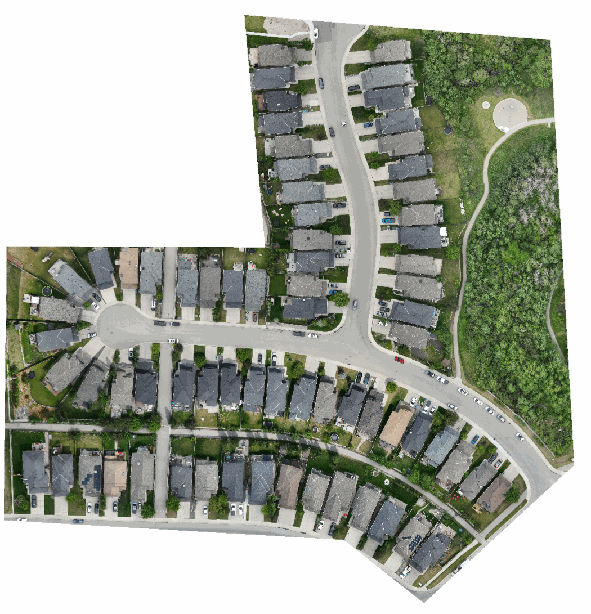
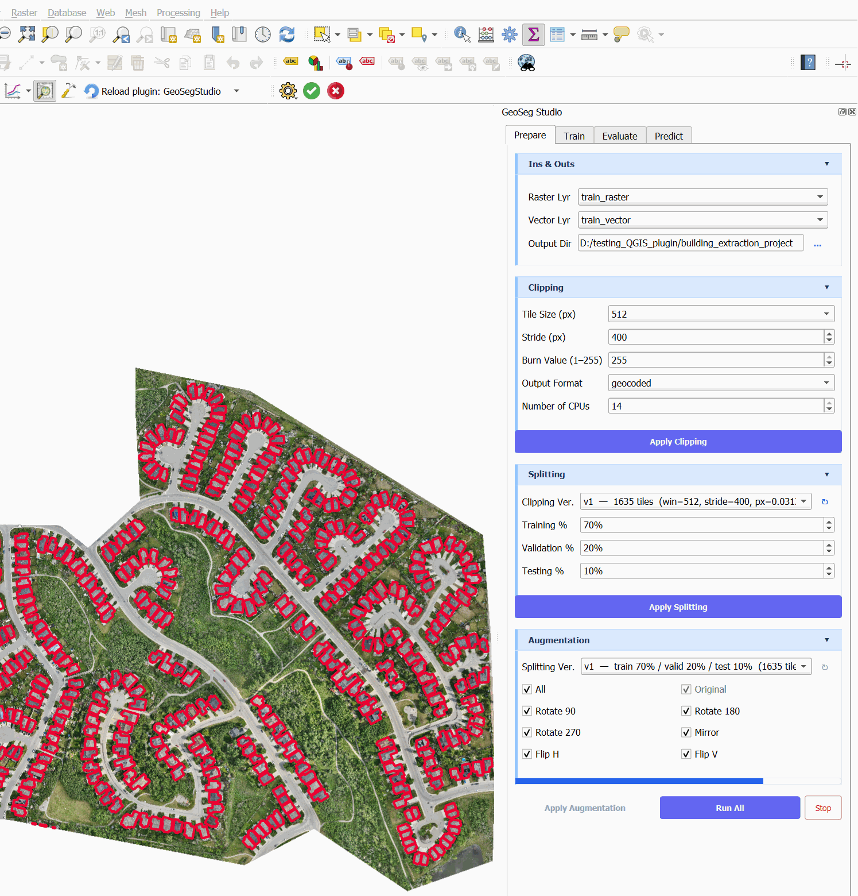
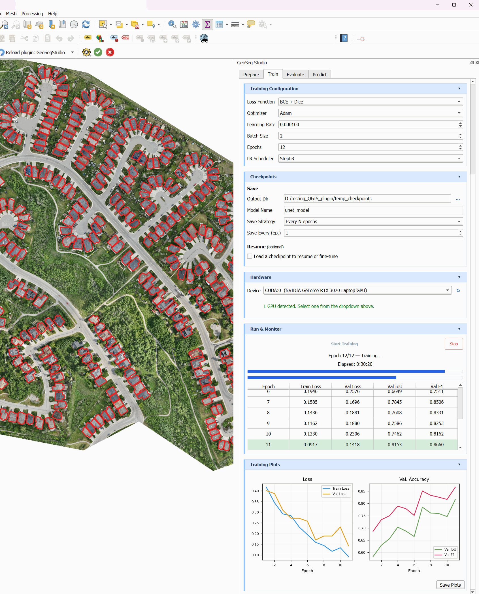
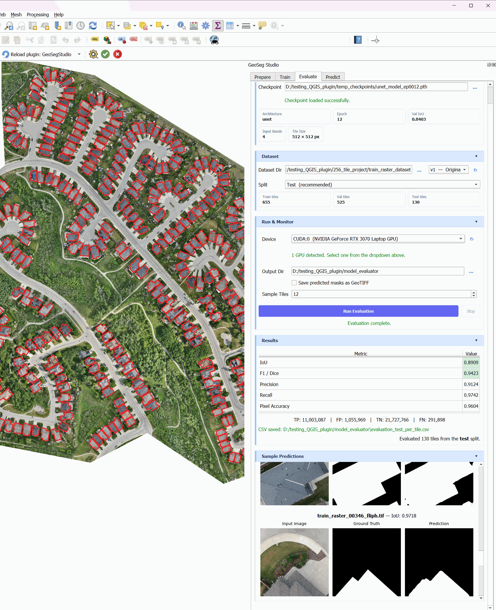
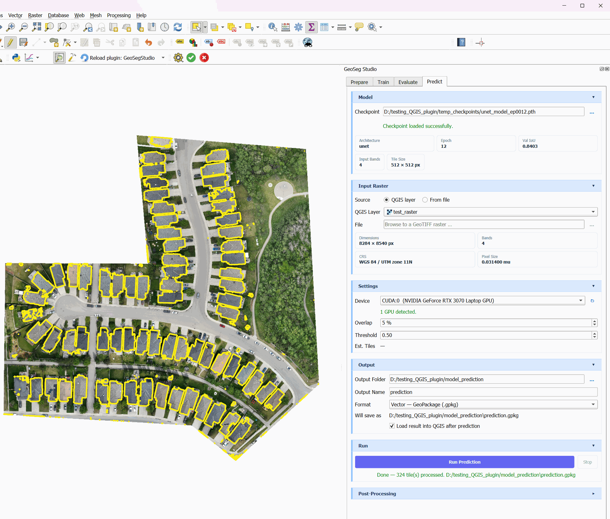
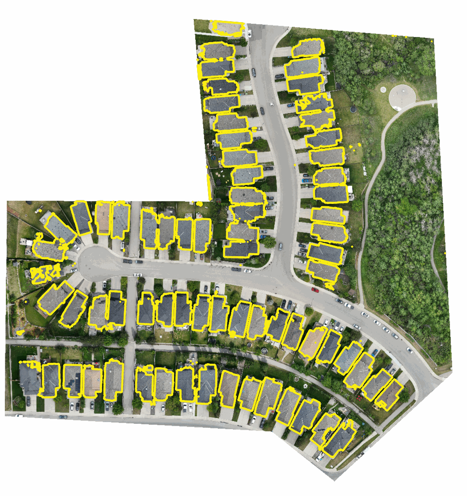

<!--
EDITORIAL NOTE — resolve before publishing.

Every figure and number in this chapter is taken from the screenshots in
docs/handbook/images/, with one exception worth checking.

The Prepare screenshot (08_prepare_tab.webp) was captured in a different
project directory (building_extraction_project, 1635 tiles, 70/20/10) from the
one the trained model actually used (256_tile_project/train_raster_dataset,
655/525/130 tiles, per the Evaluate tab). The train -> evaluate -> predict
chain is internally consistent: the same checkpoint unet_model_ep0012.pth
appears in all three, and epoch 12's val IoU of 0.8403 follows epoch 11's
0.8153 in the training table.

Section 8.4 therefore describes the clipping and splitting *settings* from the
screenshot but quotes the tile counts from the Evaluate tab, which are the
counts the model was really trained on. A careful reader comparing the text to
the screenshot will notice the mismatch. Before publishing, either re-capture
the Prepare tab from the real run, or confirm the true split so the text and
figure agree.

The 655/525/130 split is also not 70/20/10 - it is closer to 50/40/10 - so the
split percentages used for the real run should be confirmed too.
-->

# Chapter 8 — Building Extraction from Drone Imagery

---

### 8.1 Why This Use Case First

Building extraction is the reference problem of geospatial segmentation. Rooftops are large, well-defined, high-contrast against grass and asphalt, and abundant in any residential survey — which makes them the fairest possible test of whether a pipeline works at all. If a tool cannot extract buildings cleanly, nothing else it claims matters.

It is also the use case with the most immediate commercial value. Municipalities need building footprints for tax assessment and permit compliance. Insurers need them for exposure modelling. Developers need them for site analysis. All of that work is still routinely done by hand, one polygon at a time.

This chapter walks through a complete project end to end: a residential drone survey in Calgary, Alberta, from raw orthomosaic to a delivered GeoPackage of building footprints. Every parameter, metric and runtime in this chapter comes from the actual run. Nothing is idealised, including the parts that did not go perfectly.

---

### 8.2 The Imagery

The survey covers a residential subdivision — detached housing on curved streets, mature trees, a greenbelt along the eastern edge, and on-street parking.



*The input orthomosaic. No labels, no processing — this is what comes back from the flight.*

| Property | Value |
|----------|-------|
| Dimensions | 8284 × 8540 px |
| Bands | 4 |
| Ground sample distance | 0.0314 m (3.14 cm) |
| Coordinate system | WGS 84 / UTM zone 11N |
| Approximate coverage | 7.0 hectares |

Three things about this imagery matter more than the rest.

**The resolution is high.** At 3.14 cm per pixel, a typical 12 × 15 m house occupies roughly 380 × 480 pixels. The model is not straining to see its target; it has abundant detail. This is the comfortable end of the difficulty range, and you should expect correspondingly strong metrics.

**There are four bands, not three.** Set Input Bands to 4 in the model configuration. A mismatch here is the single most common cause of a model that trains but predicts nonsense — the tensor shapes are compatible enough not to error, and wrong enough not to work.

**The extent is irregular.** The orthomosaic is L-shaped with white nodata surrounding it. This matters at tiling time, and Section 8.4 explains why.

---

### 8.3 Labelling the Training Area

The training labels are polygons drawn over building rooftops in QGIS — an ordinary vector layer in the same coordinate system as the raster, with one polygon per building.

Three rules make the difference between a usable label set and a frustrating one.

**Label the roof, not the footprint.** From a nadir drone view you see the roof. On a two-storey house with overhanging eaves the roof is meaningfully larger than the ground footprint, and at 3 cm resolution that difference is tens of pixels. Decide which you are mapping and be consistent. Inconsistency here puts a ceiling on achievable IoU that no amount of training will lift, because you are asking the model to learn a distinction you did not make yourself.

**Label everything in the training area, without exception.** Any unlabelled building becomes a false negative during training — the model is explicitly taught that this particular roof is background. A handful of these teaches the model to distrust exactly the features you want it to learn. Partial labelling is worse than a smaller, completely labelled area.

**Keep a genuinely separate area for prediction.** In this project one area was labelled for training, and a second, adjacent area was held back entirely for the final prediction in Section 8.8. That second area was never tiled, never trained on, and never evaluated against — which is the only way the prediction result means anything.

---

### 8.4 Preparing the Dataset



*The Prepare tab. Run All executes clipping, splitting and augmentation in sequence.*

**Clipping settings**

| Parameter | Value | Reasoning |
|-----------|-------|-----------|
| Tile size | 512 px | ≈ 16 m on the ground, enough to contain a whole house plus context |
| Stride | 400 px | 112 px of overlap, so buildings on tile edges also appear whole elsewhere |
| Burn value | 255 | Standard binary mask |
| Output format | geocoded | Keeps georeferencing on every tile |
| CPU threads | 14 | Clipping is I/O and CPU bound; use what the machine has |

The tile size choice deserves explanation. At 3.14 cm, 512 px covers about 16 m — comfortably larger than a single house. That matters because a model that only ever sees fragments of roofs learns texture, not shape. Give it the whole object and the surrounding context, and it learns what a building *is*.

The stride of 400 px is deliberately smaller than the tile size. The resulting overlap means a building unlucky enough to be bisected by one tile boundary appears intact in a neighbouring tile. Without overlap, every building on a grid line is a partial example.

**Splitting and augmentation**

The dataset the model was trained on contains **655 training tiles, 525 validation tiles and 130 test tiles**. Augmentation was applied to the training set with all seven transforms enabled: original, rotate 90/180/270, mirror, flip horizontal and flip vertical.

Rotation and flipping are legitimate for nadir aerial imagery in a way they are not for ground photography. A building rotated 90° is still a plausible building — there is no gravity cue in an overhead view to violate. This is close to free training data, and for a dataset of this size it matters.

One caution specific to irregular extents: the L-shaped orthomosaic means some tiles fall largely in the white nodata region. These contribute nothing and slightly dilute the training signal. Check the clipped output and discard near-empty tiles before splitting.

---

### 8.5 Choosing the Model

**UNet**, at 512 × 512 with 4 input bands.

For a first project on a new dataset, UNet is almost always the right starting point, and the reasoning is not that it is the most accurate architecture available — it frequently is not. It is that UNet trains fast, converges reliably, is forgiving of hyperparameter choices, and gives you a trustworthy baseline in under an hour. Only once you know what the problem's achievable accuracy looks like does it make sense to spend time on a transformer.

Buildings also happen to suit UNet well. They are large, contiguous, high-contrast shapes with clear boundaries. The long-range context modelling that Swin-UNet or SegFormer provide buys you the most on thin, fragmented or texture-ambiguous classes. A rooftop is none of those.

---

### 8.6 Training



*Training in progress. The metrics table and live loss curves update after every epoch.*

| Parameter | Value |
|-----------|-------|
| Architecture | UNet |
| Loss function | BCE + Dice |
| Optimizer | Adam |
| Learning rate | 0.0001 |
| Batch size | 2 |
| Epochs | 12 |
| LR scheduler | StepLR |
| Device | NVIDIA GeForce RTX 3070 Laptop GPU |
| **Total training time** | **30 minutes 20 seconds** |

Thirty minutes, on a laptop, for a working building extraction model. That number is the entire argument for this workflow. The same result assembled by hand — environment, data loaders, training loop, checkpointing, metrics — is a week of work for someone who already knows how.

**Batch size 2** is dictated by memory. At 512 × 512 with 4 bands, a UNet activation stack is large, and a laptop GPU with 8 GB cannot hold much more. Small batches make gradient estimates noisier, which you can see directly in the validation curve below.

**BCE + Dice** is the right default for this problem. Binary cross-entropy optimises per-pixel correctness; Dice optimises region overlap, which is what IoU actually measures. Together they behave better on class-imbalanced data than either alone. Here roughly a third of all pixels are building — mild imbalance, well within what this combination handles.

**How the run actually went**

| Epoch | Train loss | Val loss | Val IoU | Val F1 |
|-------|-----------|----------|---------|--------|
| 6 | 0.1946 | 0.2576 | 0.6649 | 0.7511 |
| 7 | 0.1585 | 0.1696 | 0.7845 | 0.8506 |
| 8 | 0.1436 | 0.1881 | 0.7608 | 0.8331 |
| 9 | 0.1162 | 0.1880 | 0.7586 | 0.8253 |
| 10 | 0.1330 | 0.2306 | 0.7462 | 0.8162 |
| 11 | 0.0917 | 0.1418 | 0.8153 | 0.8660 |
| 12 | — | — | **0.8403** | — |

Read epochs 8 to 10 carefully, because this is the part of a real training run that tutorials omit. Training loss kept falling while validation loss climbed to 0.2306 and validation IoU sagged from 0.7845 down to 0.7462. Three consecutive epochs moving the wrong way.

That pattern — train down, validation up — is the textbook signature of overfitting, and the textbook response is to stop. It would have been the wrong call here. Epoch 11 recovered sharply to 0.8153, and epoch 12 reached 0.8403, the best result of the run.

What actually happened is noise. With batch size 2 and 525 validation tiles, per-epoch validation metrics bounce around a lot, and a three-epoch excursion is well within the range of ordinary variance. Genuine overfitting shows up as a sustained divergence that does not recover, usually alongside a training loss that has flattened near zero. Train loss was still falling steadily throughout, from 0.1946 to 0.0917.

The practical lesson: **judge the trend over five or more epochs, not three.** Save every epoch — the Save Every N epochs strategy, set to 1, costs disk space and buys you the ability to recover the best checkpoint after the fact rather than guessing during the run.

---

### 8.7 Evaluating Honestly



*Evaluation on the held-out test split, with per-tile sample predictions below the metrics.*

Evaluation ran the epoch 12 checkpoint against the **130-tile test split**, using the original non-augmented tiles.

| Metric | Value |
|--------|-------|
| IoU | 0.8909 |
| F1 / Dice | 0.9423 |
| Precision | 0.9124 |
| Recall | 0.9742 |
| Pixel accuracy | 0.9604 |

| Confusion matrix | Pixels |
|------------------|--------|
| True positives | 11,003,087 |
| False positives | 1,055,969 |
| True negatives | 21,727,766 |
| False negatives | 291,898 |

An IoU of 0.89 on building extraction is a strong result. For context, published benchmarks on aerial building segmentation typically land in the 0.70–0.85 range, though on harder imagery — lower resolution, denser urban form, more varied roof materials — than a 3 cm residential survey.

**Three things in these numbers are worth understanding.**

**Recall exceeds precision by a wide margin** — 0.9742 against 0.9124. There are 1,055,969 false positive pixels against only 291,898 false negatives: the model over-predicts by roughly 3.6 to 1. In plain terms, it finds essentially every building but draws them slightly too large, spilling a few pixels onto driveways, shadows and adjacent grass.

For building extraction this is the error direction you want. A footprint that is 2% too large is trivially fixed by a human reviewer or a morphological erosion; a building that was never detected requires someone to notice it is missing. If you needed to rebalance, raising the sigmoid threshold from 0.50 to around 0.55–0.60 would trade some recall for precision.

**Test IoU (0.8909) is higher than validation IoU (0.8403).** Test scores exceeding validation scores should always prompt a question, because the usual cause is leakage between splits. Here there are two innocent explanations. The test split is small — 130 tiles against 525 — so its score is noisier. More importantly, validation ran against augmented tiles while evaluation ran against the original set, and rotated or mirrored tiles are genuinely slightly harder. The gap is explainable, but it is exactly the kind of thing worth confirming rather than celebrating.

**The class balance is favourable.** True positives plus false negatives gives 11,294,985 building pixels out of 34,078,720 total — about 33% foreground. That is unusually generous for segmentation. Solar panels or vehicles in the same imagery would be 1–3% foreground, and pixel accuracy becomes a near-useless metric at those ratios. Trust IoU and F1; treat 0.9604 pixel accuracy as the least informative number in the table.

---

### 8.8 Predicting on Unseen Imagery



*Prediction settings. The model metadata at the top is read directly from the checkpoint.*

The trained checkpoint was applied to a raster that played no part in training, validation or evaluation.

| Setting | Value |
|---------|-------|
| Input raster | 8284 × 8540 px, 4 bands, 0.0314 m |
| Overlap | 5% |
| Sigmoid threshold | 0.50 |
| Output format | GeoPackage (.gpkg) |
| **Tiles processed** | **324** |

The 324 tiles are an 18 × 18 grid: at 512 px with 5% overlap the window advances 486 px per step, and 8284 and 8540 pixels each require 18 steps to cover.

**The overlap setting here is low, and deliberately flagged.** Chapter 7 recommends 50% for final deliverables and 5% is far below that. This run used 5% for speed during development. It works acceptably on buildings — large objects whose predictions are stable across window positions — but it is not what you should ship. Section 8.10 returns to this.



*The result: extracted footprints over imagery the model had never seen.*

---

### 8.9 Reading the Output Critically

The temptation on seeing that result is to declare success. Look harder, because the flaws are visible and each one tells you something.

**What worked.** Nearly every building in the extent is detected, including houses partly shaded by mature trees and roofs of varying colour. Detached houses in rows are correctly separated rather than fused into terraces — a common failure at this density. Boundaries follow roof edges closely.

**Small spurious polygons.** Scattered yellow fragments appear in vegetation, on driveways and along the eastern greenbelt, none larger than a few square metres. These are the false positives the precision figure predicted. They are trivially removed by a minimum-area filter, and Section 8.10 sets one.

**Ragged edges.** Polygons follow the pixel grid exactly, producing a staircase along every roofline. This is inherent to vectorising a raster mask, not a model defect, and simplify plus smooth resolve it.

**Slightly inflated footprints.** Consistent with precision 0.9124, many polygons extend a little past the true roof edge. If your deliverable requires accurate area measurement — tax assessment, material estimation — either raise the threshold or apply a small negative buffer, and validate against hand-measured control buildings before delivering.

**Boundary artifacts.** Along the irregular edge of the orthomosaic, where imagery meets nodata, a few thin slivers appear. Clip the prediction to the valid data extent before delivery.

---

### 8.10 Post-Processing to a Deliverable

Raw vector output is a result. A deliverable needs post-processing.

| Step | Setting | Why |
|------|---------|-----|
| Merge | 1.0 m | Rejoins roofs split across window boundaries |
| Fill holes | 10 m² | Removes skylights and HVAC units; keeps real courtyards |
| Min area | 10 m² | Eliminates the vegetation fragments from 8.9 |
| Max area | Off | No plausible upper bound on building size |
| Simplify | 0.5 m | Removes the staircase, preserves shape |
| Smooth | 3 iterations | Natural-looking edges without distortion |

A minimum area of 10 m² is safe for detached residential housing, where the smallest real structure — a detached garage or large shed — is comfortably above it. Raise it for commercial surveys; lower it, carefully, if you must capture small outbuildings.

**For a production run, change two things.** Raise overlap from 5% to 50%, accepting roughly a 4× increase in inference time for cleaner window boundaries. And consider raising the threshold to 0.55 to pull those inflated footprints back toward the true roof edge. Neither requires retraining — both are prediction-time settings, so you can iterate on them in minutes.

---

### 8.11 What We Would Do Differently

Honest retrospective, in order of expected impact.

**Train longer.** Validation IoU was still improving at epoch 12 — 0.8153 then 0.8403, with no sign of a plateau. The run stopped because 12 epochs was configured, not because the model had converged. Another 10–15 epochs would very likely have gained a point or two of IoU for about 30 more minutes.

**Use 50% overlap for the final prediction.** Covered above. Development speed is not a reason to ship a lower-quality deliverable.

**Check the tile counts before training.** The dataset used 655 training and 525 validation tiles — an unusually large validation fraction. Shifting toward 70/20/10 would have put roughly 900 tiles into training instead of 655, a meaningful increase for a dataset this size.

**Sweep the threshold on the validation set.** The default 0.50 was never tuned. Given the precision/recall asymmetry, a short sweep from 0.45 to 0.65 would likely have found a better operating point at no cost.

---

### 8.12 Reproducing This

The complete configuration:

```
Prepare
  Tile size          512 px
  Stride             400 px
  Burn value         255
  Output format      geocoded
  Augmentation       all 7 transforms

Train
  Architecture       UNet
  Input bands        4
  Tile size          512 x 512
  Loss               BCE + Dice
  Optimizer          Adam
  Learning rate      0.0001
  Batch size         2
  Epochs             12  (recommend 25)
  LR scheduler       StepLR
  Save strategy      every 1 epoch

Predict
  Overlap            5%  (recommend 50%)
  Threshold          0.50
  Output             GeoPackage

Post-process
  Merge              1.0 m
  Fill holes         10 m2
  Min area           10 m2
  Simplify           0.5 m
  Smooth             3 iterations
```

A comparable dataset is published for exactly this purpose:

**Drone Building Extraction Dataset — Calgary**
`huggingface.co/datasets/dronnix-io/drone-building-extraction`

Expect results in the same range on similar imagery. On lower-resolution input, denser urban form, or more varied roof materials, expect lower — and treat anything above 0.85 IoU on a first attempt as a signal to check your splits for leakage rather than as cause for celebration.

---

*Next: Chapter 9 — Solar Panel Detection from Thermal and RGB Imagery*
